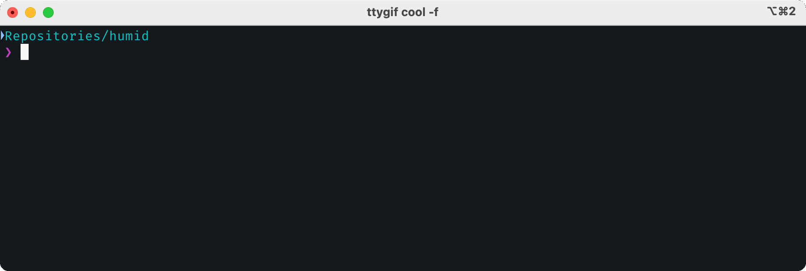

<a name="readme-top"></a>
[](https://pepy.tech/project/humid)
[](https://github.com/pre-commit/pre-commit)
[](https://github.com/astral-sh/ruff)
[](https://squidfunk.github.io/mkdocs-material/)

<!-- PROJECT LOGO -->

<br />
<div align="center">
    <div align="center">
    
    </div>
  <!-- <h3 align="center">humid</h3> -->

  <p align="center">
    Human Friendly UUIDs
    <br />
    <a href="https://h0uter.github.io/humid"><strong>Explore the docs »</strong></a>
    <br />
    <br />
    <a href="https://github.com/h0uter/humid/issues/new?labels=bug&title=New+bug+report">Report Bug</a>
    ·
    <a href="https://github.com/h0uter/humid/issues/new?labels=enhancement&title=New+feature+request">Request Feature</a>
  </p>
</div>

<!-- TABLE OF CONTENTS -->
<details>
  <summary>Table of Contents</summary>
  <ol>
    <li><a href="#about-the-project">About the Project</a></li>
    <li><a href="#quickstart">Quickstart</a></li>
    <li><a href="#planned-improvements">Planned Improvements</a></li>
  </ol>
</details>

# About the Project

<div align="center">
    
</div>

`humid` makes it easy to generate **h**uman **r**eadable uu**id**'s (`hrid`'s) that are readable and pronounceable. Creation follows the pattern: `{ADJECTIVE}-{ANIMAL|POKEMON}-{UUID*22}`.


<div align="right">(<a href="#readme-top">back to top</a>)</div>

# Quickstart

install
```sh
pip install humid
python -m humid
>> elegant-redfox-vkynw0OlJDxI15gcgdLmUn
```

Use in Python code
```python
from humid import hrid

uuid = hrid()
print(uuid)
>> elegant-redfox-vkynw0OlJDxI15gcgdLmUn
```

<!--
<div align="right">(<a href="#readme-top">back to top</a>)</div>


# Why humid?

-  -->


<div align="right">(<a href="#readme-top">back to top</a>)</div>

# Planned Improvements

- [ ] command line options
  - [ ] different types of hrid's
- [ ] setup script alias


<div align="right">(<a href="#readme-top">back to top</a>)</div>
